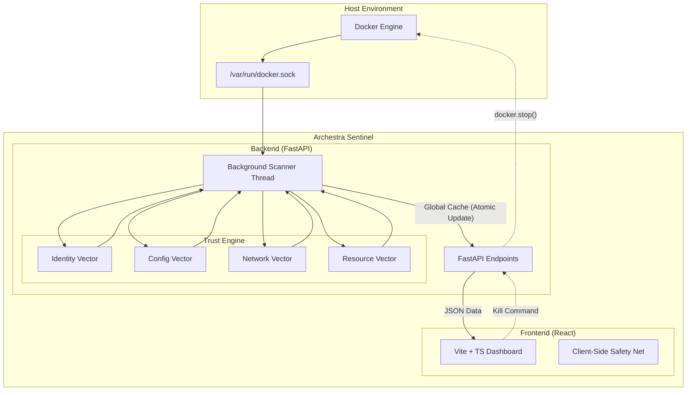

# Archestra Sentinel 🛡️

### **The Security Guard for the AI-Agent Era**


---

## 🚨 The Problem: Shadow AI

In the era of autonomous AI agents, traditional security tools are blind. Developers and automated systems spin up Docker containers dynamically, often bypassing IT governance. This leads to **Shadow AI**:

*   **Invisible Infrastructure**: Containers running without oversight.
*   **Security Gaps**: Root privileges, exposed ports (0.0.0.0), and unverified images.
*   **Runaway Costs**: "Zombie" agents consuming resources unchecked.

**Visibility is impossible without Sentinel.** You cannot patch what you cannot see.

---

## 🛡️ The Sentinel Solution

Archestra Sentinel is an **Enterprise-Grade Governance & Observation Platform** designed specifically for agentic workflows. It acts as a bridge between the **Archestra Gateway** and the **Docker Engine**, providing real-time visibility, security scoring, and automated governance.

### How It Works
Sentinel connects directly to the Docker Socket (`/var/run/docker.sock`) using a high-performance **TCP Bridge**, bypassing standard API lag. It instantly detects every container spin-up, analyzes its configuration against strict security policies, and assigns a **Trust Score**.

> **"If it runs, Sentinel sees it."**

---

## 🧠 Trust Intelligence Framework

At the heart of Sentinel is the **4-Vector Trust Engine**. Unlike simple status checks, Sentinel performs a deep inspection of every container using a weighted algorithm to calculate a **Trust Score (0-100)**.

| Vector | Weight | Inspection Criteria |
| :--- | :--- | :--- |
| **1. Identity** | **30%** | **Image Verification**: Checks against a strict `SANCTIONED_IMAGES` whitelist (e.g., `archestra/platform`). Penalizes unknown registries or public Docker Hub images. |
| **2. Configuration** | **30%** | **Security Posture**: Detects `Root User` execution, `Privileged Mode` (major risk), and `ReadOnlyRootfs` status. |
| **3. Network** | **20%** | **Exposure Surface**: Scans for `0.0.0.0` bindings (High Risk) vs. `127.0.0.1` (Safe). Flags critical ports (22, 23, 2375). |
| **4. Resources** | **20%** | **Footprint Analysis**: Monitors CPU/Memory limits. Penalizes containers with **No Memory Limit** (Risk of OOM crashes) or High Usage (>80%). |

*   **Trust Score < 40**: 🔴 **CRITICAL** (Immediate Alert)
*   **Trust Score < 60**: 🟠 **HIGH RISK**
*   **Trust Score < 80**: 🟡 **ELEVATED**
*   **Trust Score >= 80**: 🟢 **HEALTHY**

---

## 💻 Dashboard Walkthrough

### 1. Executive Overview
A high-level "Mission Control" view for CTOs and Security Leads. Displays the **Global System Health**, **Total Active Agents**, and **Financial Impact**.


---

### 2. Discovery & Governance
Real-time inventory of all running AI Agents. Features **Real-time Risk Scores** calculated by the Trust Engine.

*   **Shadow AI Detection**: Instantly flags unsanctioned images.
*   **Live Metadata**: Shows Image ID, Uptime, and Port Bindings.


---

### 3. Security Command Center
The operational hub for threat response.
*   **Alert Fallback System**: Even if the backend lags, the frontend "Safety Net" catches critical vulnerability patterns.
*   **Kill Switch**: Admin capability to terminate non-compliant agents instantly.


---

### 4. Cost Intelligence
Financial observability for AI scaling.
*   **Burn Rate Calculation**:
    *   **Active Agent Cost**: Base `$300/day` + Risk Penalties (Critical agents cost +$150/day due to remediation overhead).
    *   **Money Saved**: Tracks stopped containers as `$250/day` in savings.


---

### 5. Audit Logs
Immutable record of all governance actions. Tracks who killed which container and when configuration drifts occurred.


---

## 🏗️ Architecture

Sentinel uses a decoupled architecture to ensure the UI remains responsive even during heavy scanning operations.



---

## 🛠️ Tech Stack

*   **Frontend**: React 18, Vite, TypeScript, TailwindCSS, Radix UI.
*   **Backend**: Python 3.9+, FastAPI, Pydantic, Docker SDK for Python.
*   **Infrastructure**: Docker Compose, Docker Socket Proxy.

---

## 🚀 Installation & Setup

Prerequisites: **Docker Desktop** installed and running.

1.  **Clone the Repository**
    ```bash
    git clone https://github.com/mohitjeswani01/archestra-sentinel.git
    cd archestra-sentinel
    ```

2.  **Start Services (Clean Environment)**
    We recommend a clean 8GB RAM environment for optimal performance.
    ```bash
    docker-compose up --build
    ```

3.  **Access the Dashboard**
    *   frontend: `http://localhost:8080`
    *   API Docs: `http://localhost:8000/docs`

4.  **Verify Connection**
    Ensure your Docker Desktop is exposing the daemon on `tcp://localhost:2375` if you are on Windows/Mac, or mapped correctly via socket in Linux.

---

*Built with ❤️ for the AI Security Community.*
